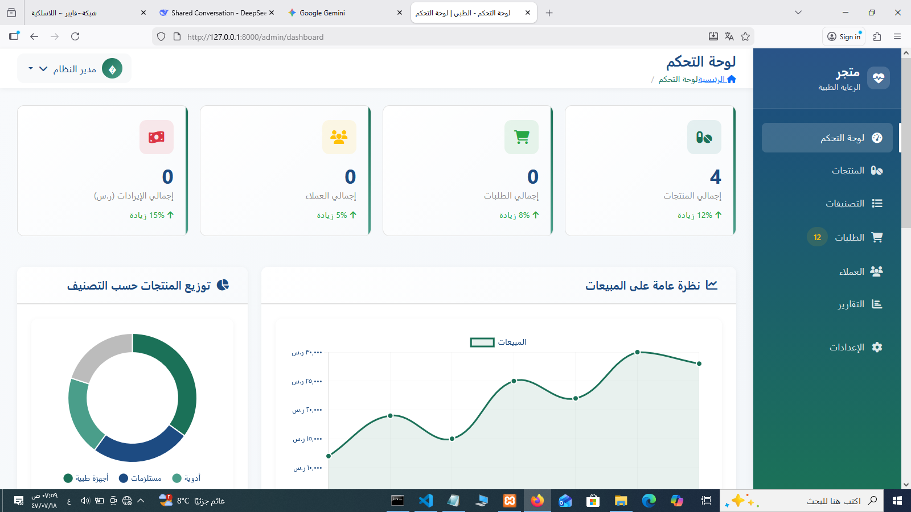

# 📋 **متجر الرعاية الطبية - لوحة التحكم**

<p align="center">
  <h1 align="center">🚑 لوحة تحكم متجر الرعاية الطبية</h1>
  <p align="center">نظام إداري متكامل لإدارة متجر الرعاية الطبية</p>
</p>

<p align="center">
  <a href="https://github.com/eng-hossam7/medical_care_dashboard/actions">
    
  </a>
  <a href="https://packagist.org/packages/laravel/framework">
    
  </a>
  <a href="https://packagist.org/packages/laravel/framework">
    
  </a>
  <a href="https://opensource.org/licenses/MIT">
    
  </a>
  <a href="#">
    
  </a>
</p>

 📖 حول المشروع

لوحة تحكم إدارية متكاملة مبنية باستخدام **Laravel 10** لإدارة متجر المستلزمات الطبية. توفر النظام إدارة كاملة للمنتجات، الطلبات، العملاء، والمخزون مع واجهة مستخدم عربية متجاوبة.

 ✨ المميزات الرئيسية

- 📊 **لوحة تحكم شاملة** مع إحصائيات فورية ومخططات بيانية
- 🏪 **إدارة المنتجات** الكاملة مع نظام تصنيفات هرمي
- 👥 **إدارة العملاء** وسجل المشتريات
- 📦 **إدارة الطلبات** وتتبع الحالة
- 🔒 **نظام أمان متكامل** مع صلاحيات المستخدمين
- 📱 **واجهة متجاوبة** تعمل على جميع الأجهزة
- 🇸🇦 **واجهة عربية كاملة** مع دعم RTL

## 🛠️ **التقنيات المستخدمة**

### **Backend**
-  Laravel 10
-  PHP 8.1+
-  MySQL 5.7+

### **Frontend**
-  Bootstrap 5 (RTL)
-  Chart.js
-  Font Awesome 6

## 📁 **هيكل المشروع**

```
medical_care_dashboard/
├── app/
│   ├── Models/              # نماذج البيانات (16 نموذج)
│   ├── Http/
│   │   ├── Controllers/     # متحكمات النظام (7 متحكمات)
│   │   └── Middleware/      # وسائط النظام
│   └── Providers/           # مقدمي الخدمات
├── database/
│   ├── migrations/          # هجرات قاعدة البيانات
│   └── seeders/             # بيانات تجريبية
├── resources/
│   └── views/
│       └── admin/
│           ├── layouts/     # قوالب الصفحات
│           ├── dashboard/   # لوحة التحكم
│           ├── products/    # إدارة المنتجات
│           ├── categories/  # إدارة التصنيفات
│           ├── orders/      # إدارة الطلبات
│           └── customers/   # إدارة العملاء
└── public/                  # الأصول العامة
```

## 🚀 **بدء الاستخدام**

### **المتطلبات المسبقة**

- PHP 8.1 أو أحدث
- Composer
- MySQL 5.7+ أو MariaDB 10.2+
- Node.js و NPM

### **خطوات التثبيت**

1. **استنساخ المستودع**
   ```bash
   git clone https://github.com/eng-hossam7/medical_care_dashboard.git
   cd medical_care_dashboard
   ```

2. **تثبيت التبعيات**
   ```bash
   composer install
   npm install
   ```

3. **إعداد البيئة**
   ```bash
   cp .env.example .env
   php artisan key:generate
   ```

4. **تكوين قاعدة البيانات**
   ```env
   DB_CONNECTION=mysql
   DB_HOST=127.0.0.1
   DB_PORT=3306
   DB_DATABASE=medical_care
   DB_USERNAME=root
   DB_PASSWORD=
   ```

5. **تشغيل الهجرات**
   ```bash
   php artisan migrate
   php artisan db:seed
   ```

6. **تشغيل الخادم**
   ```bash
   php artisan serve
   ```

7. **الدخول للنظام**
   - العنوان: `http://localhost:8000/login`
   - المستخدم الافتراضي: admin@medical.com
   - كلمة المرور: password

## 📊 **المكونات الرئيسية**

### **1. لوحة التحكم (Dashboard)**
- إحصائيات فورية للمبيعات والطلبات
- مخططات بيانية تفاعلية
- أحدث الطلبات والمنتجات
- نظرة عامة على أداء المتجر

### **2. إدارة المنتجات**
- إضافة وتعديل المنتجات الطبية
- نظام تصنيفات هرمي
- إدارة المخزون والتنبيهات
- رفع صور متعددة للمنتجات
- نظام العروض والتخفيضات

### **3. إدارة الطلبات**
- إنشاء وتعديل الطلبات
- تتبع حالة الطلب (معلق، قيد المعالجة، تم الشحن، إلخ)
- طباعة الفواتير
- إدارة المدفوعات المرتبطة

### **4. إدارة العملاء**
- سجل العملاء ومعلوماتهم الشخصية
- تاريخ المشتريات لكل عميل
- إحصائيات الإنفاق والشراء
- نظام الملاحظات الخاصة

### **5. إدارة التصنيفات**
- نظام تصنيفات متعدد المستويات
- ترتيب التصنيفات بالسحب والإفلات
- إحصائيات المنتجات في كل تصنيف

## 🔒 **نظام الأمان**

### **أنواع المستخدمين**

| الدور | الصلاحيات |
|-------|-----------|
| **المدير (Admin)** | صلاحيات كاملة على النظام |
| **الموظف (Employee)** | إدارة الطلبات والعملاء والمنتجات |
| **العميل (Customer)** | عرض المنتجات وإجراء الطلبات |

### **إجراءات الأمان**
- تشفير كلمات المرور باستخدام Bcrypt
- حماية من هجمات CSRF
- التحقق من صحة البيانات المدخلة
- نظام Middleware للصلاحيات

## 📈 **الإحصائيات والتقارير**

### **الإحصائيات المتوفرة**
- عدد المنتجات النشطة
- عدد الطلبات اليومية
- إجمالي الإيرادات
- عدد العملاء الجدد
- المنتجات الأكثر مبيعاً
- المخزون المنخفض

### **المخططات البيانية**
- مخطط المبيعات الشهرية
- توزيع المنتجات حسب التصنيف
- إحصائيات العملاء حسب الجنس
- نسبة حالات الطلبات

## 🎨 **التصميم والواجهة**

### **مميزات التصميم**
- واجهة عربية كاملة مع دعم RTL
- تصميم متجاوب يعمل على جميع الأجهزة
- ألوان طبية مخصصة (أخضر، أزرق)
- تأثيرات حركية سلسة
- أيقونات طبية مميزة

### **المكونات المصممة**
- بطاقات إحصائية متحركة
- جداول قابلة للترتيب والفلترة
- نماذج إدخال محسنة
- أزرار وإشعارات مخصصة
- مخططات بيانية تفاعلية

## 📱 **التوافق**

### **المتصفحات المدعومة**
- Chrome (الإصدار الأخير)
- Firefox (الإصدار الأخير)
- Safari (الإصدار الأخير)
- Edge (الإصدار الأخير)

### **الأجهزة المدعومة**
- أجهزة الكمبيوتر المكتبية
- أجهزة اللابتوب
- الأجهزة اللوحية
- الهواتف الذكية

## 🤝 **المساهمة**

نرحب بمساهماتكم! للمساهمة في المشروع:

1. Fork المشروع
2. إنشاء فرع للميزة الجديدة (`git checkout -b feature/AmazingFeature`)
3. Commit التغييرات (`git commit -m 'Add some AmazingFeature'`)
4. Push إلى الفرع (`git push origin feature/AmazingFeature`)
5. فتح Pull Request

## 📄 **الترخيص**

هذا المشروع مرخص تحت رخصة MIT. انظر ملف [LICENSE](LICENSE) للمزيد من التفاصيل.

## 📞 **الدعم**

للدعم الفني أو الاستفسارات:

- **المشاكل التقنية:** إنشاء Issue في GitHub
- **الاقتراحات:** قسم Discussions
- **البريد الإلكتروني:** hossamalsaydy@gmail.com

## 🙏 **شكر وتقدير**

نشكر جميع المساهمين الذين ساعدوا في تطوير هذا النظام. خاصة:

- مجتمع المصادر المفتوحة
- جميع المستخدمين الذين قدموا ملاحظاتهم القيمة

---

<p align="center">
  <strong>🚀 نظام إداري متكامل لإدارة متجر المستلزمات الطبية</strong><br>
  <em>لأي استفسار، لا تتردد في التواصل معنا</em>
</p>
